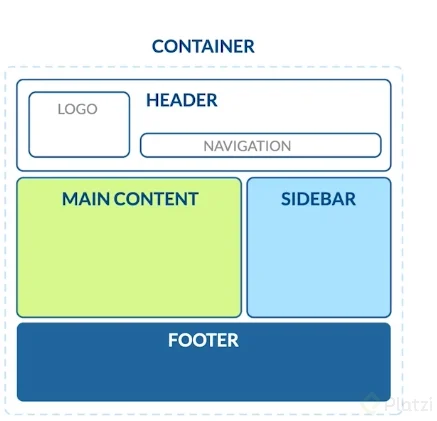
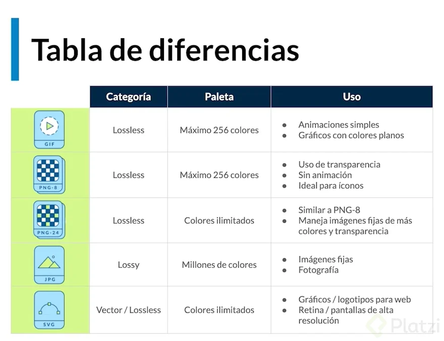

# [Curso Definitivo de HTML y CSS](https://platzi.com/cursos/html-css/)

* Inicio: 23/06/2025
  
## Páginas estáticas vs Dinámicas
* Estáticas: Tienen información para consumir (texto, imágenes) que no va a cambiar. Ej: Blog Tambien se les llama **páginas informativas** o ***landing pages***. No están conectadas a una base de datos.
* Dinámicas: También conocidas como ***WebApps***. Están conectadas a bases de datos y se pueden manejar estados.

## Estructura básica de HTML en una página Web
* Container: contenedor principal.
* Header: cabecera de la página. Aquí usualmente encuentras el logo y el menú de navegación del sitio.
* Main content: estructura principal. Por ejemplo, el feed o lista de publicaciones de una red social.
* Sidebar: contenido secundario de una página, que usualmente se encuentra a los lados del contenido principal (o main).
* Footer: pie de página. Esto se encuentra al fondo del sitio web, salvo en casos de sitios web donde el scroll (o navegación hacia abajo) es infinito, por ende, no tendría sentido ponerlo al fondo.

Existen etiquetas de contenido y etiquetas contenedoras.

### Etiquetas del cuerpo del documento (body):
* article: diferencia partes del contenido que pueden vivir por sí mismas.
* nav: para hacer menús de navegación.
* aside: contenido menos relevante, como publicidad, etc.
* section: sirve para diferenciar las secciones principales del contenido.
* header: cabecera del documento.
* footer: pie de página del documento.
* h1 - h6: títulos de nuestro sitio web.
* table: tablas de contenidos, similar a la estructura de las hojas de calculo.
* ul y ol: listas de items.
* div: cualquier división para organizar el contenido.
* h1 a h6: son etiquetas para indicar títulos con un estilo que destaca del resto.
* article: es la parte de nuestro contenido que puede vivir por sí mismo. Pueden haber tantos artícle como proyectos o eventos tenga nuestro portafolio.
* p: define el texto de un párrafo.
* small: aplica una apariencia de texto reducido en tamaño.
* strong: aplica al texto un formato de negritas.
* a: corresponde a un ancla o enlace a una url interna o externa del documento.
* img: con esta etiqueta podemos enlazar imágenes en el documento.
* figure: le da un contexto semántico a las imágenes.

## Formatos de Imágenes y su Uso en Desarrollo Web

### Lossless (sin pérdida):
* Capturan todos los datos del archivo original.
* No se pierde nada del archivo original.
* Puede comprimirse, pero podrá reconstruir su imagen al estado original.
### Lossy (con pérdida):
* Se aproximan a su imagen original.
* Podría reducir la cantidad de colores en su imagen o analizar la imagen en busca de datos innecesarios.
* Por consiguiente puede reducir su tamaño, lo que mejora el tiempo de carga de la página, pero pierde su calidad.
* Los archivos tipo lossy son mucho más livianos que los archivos tipo lossless, por lo que son ideales para usar en sitios en donde el tamaño del archivo y la velocidad de descarga son importantes.

* **GIF (Graphics Interchange Format)**: Formato de imagen sin pérdida, no se puede comprimir.
* **PNG 8 (Portable Network Graphics)**: Formato de imagen sin pérdida, uso de colores de 256, se utiliza para logotipos e iconos para la página.
* **PNG 24 (Portable Network Graphics)**: Formato de imagen sin pérdida, utilización de colores ilimitados, alta calidad, si intentamos comprimir no ayudará demasiado por la gran cantidad de colores.
* **JPG / JPEG (Photographic Experts Group)**: Formato de imagen con pérdida, perdemos calidad a la hora de comprimirlas, pero llegan a ser óptimas para la carga en la página web.
* **SVG - Vector (Scalable Vector Graphics)**: Formato de imagen muy ligero sin pérdida, con svg no perdemos calidad, ya que está compuesta por vectores.
* **WebP**: Es un formato gráfico en forma de contenedor que sustenta tanto compresión con pérdida como sin ella. ​​Fue desarrollado por Google.

La etiqueta **video**, tiene algunos atributos como: .

* **controls**: agrega al video los controles necesarios para reproducir, pausar y adelantar.

* **preload = auto**: hace que el navegador descargue el video, en el momento en el que se acceda a la página.

La etiqueta **source**, se puede colocar dentro de una etiqueta **video** varias veces, para especificar diferentes rutas y formatos del mismo video. Esto para asegurar que cualquier navegador pueda mostrar el video.

## ¿Por qué los formularios son tan importantes?

Los formularios son esenciales en los productos web porque son la principal forma en que interactuamos con los usuarios. Nos permiten solicitar o recibir información de los visitantes, ya sea para registrar cuentas de usuario, completar transacciones de compras o recolectar retroalimentación. Sin embargo, a menudo pueden ser una barrera si no están bien diseñados. Formularios que son confusos o demasiado largos pueden alejar a los usuarios potenciales.
¿Cómo se estructura un formulario HTML correctamente?

Al estructurar un formulario en HTML, es imprescindible usar la etiqueta *<form>* y añadirle atributos como method y action. Estas etiquetas y atributos direccionan las interacciones del formulario, comunicándole al navegador que los datos introducidos se gestionarán adecuadamente. A continuación, presentamos un ejemplo básico de cómo iniciar esta estructura:
'''
    <form action="/submit-data" method="post">
    <label for="name">Nombre:</label>
    <input type="text" id="name" name="name">
    
    <label for="email">Correo electrónico:</label>
    <input type="email" id="email" name="email">
    
    <button type="submit">Enviar</button>
    </form>
'''
¿Cómo mejorar la experiencia del usuario?

Para enriquecer la experiencia del usuario en los formularios, puedes seguir estas recomendaciones:

    Simplicidad: Reduce los campos a los necesarios.
    Guías visuales: Utiliza etiquetas y placeholders que orienten al usuario sobre qué información necesita proporcionar.
    Proporciona retroalimentación: Después de enviar, confirma el éxito o indica errores de manera clara.

¿Qué tipos de inputs existen?

HTML ofrece una amplia variedad de tipos de inputs que permiten recibir diferentes formatos de datos. Entre los más comunes están:

    Text: Para texto regular, como nombres o direcciones.
    Email: Que incluye validación básica para formatos de correo electrónico.
    Date: Permite al usuario seleccionar una fecha desde un calendario desplegable.
    Time: Brinda una interfaz para que el usuario seleccione una hora específica del día.
    Number: Permite inputs numéricos, lo que limita el tipo de información que puede ser ingresada.

Aquí un ejemplo de cómo se configuran estos inputs:

<label for="startdate">Fecha de inicio:</label>
<input type="date" id="startdate" name="startdate">

<label for="timestudy">Hora de estudio:</label>
<input type="time" id="timestudy" name="timestudy">

¿Qué es un Placeholder y por qué es útil?

El atributo placeholder en los inputs HTML es crucial para mejorar la claridad en los formularios. Al proporcionar un texto sugerido dentro del campo de entrada, orienta al usuario sobre el formato o el tipo de información esperada. Por ejemplo:

<input type="text" id="name" name="name" placeholder="Introduce tu nombre completo">

El uso efectivo de placeholders mejora considerablemente la experiencia del usuario al hacer más intuitivo el proceso de llenado del formulario, además de disminuir posibles errores en la introducción de datos.

Los formularios bien diseñados no solo favorecen una mejor experiencia del usuario, sino que también mejoran la interacción y conversión en cualquier plataforma digital. Mantén siempre en mente que un formulario efectivo es fácil de entender y rápido de completar.