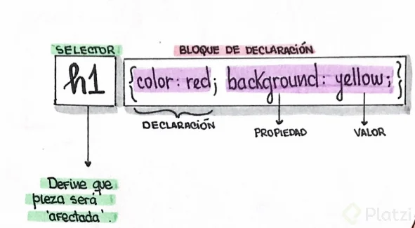

# [Curso Definitivo de HTML y CSS](https://platzi.com/cursos/html-css/)

* Inicio: 23/06/2025
  
## Páginas estáticas vs Dinámicas
* Estáticas: Tienen información para consumir (texto, imágenes) que no va a cambiar. Ej: Blog Tambien se les llama **páginas informativas** o ***landing pages***. No están conectadas a una base de datos.
* Dinámicas: También conocidas como ***WebApps***. Están conectadas a bases de datos y se pueden manejar estados.

## Estructura básica de HTML en una página Web
* Container: contenedor principal.
* Header: cabecera de la página. Aquí usualmente encuentras el logo y el menú de navegación del sitio.
* Main content: estructura principal. Por ejemplo, el feed o lista de publicaciones de una red social.
* Sidebar: contenido secundario de una página, que usualmente se encuentra a los lados del contenido principal (o main).
* Footer: pie de página. Esto se encuentra al fondo del sitio web, salvo en casos de sitios web donde el scroll (o navegación hacia abajo) es infinito, por ende, no tendría sentido ponerlo al fondo.


Existen etiquetas de contenido y etiquetas contenedoras.

### Etiquetas del cuerpo del documento (body):
* article: diferencia partes del contenido que pueden vivir por sí mismas.
* nav: para hacer menús de navegación.
* aside: contenido menos relevante, como publicidad, etc.
* section: sirve para diferenciar las secciones principales del contenido.
* header: cabecera del documento.
* footer: pie de página del documento.
* h1 - h6: títulos de nuestro sitio web.
* table: tablas de contenidos, similar a la estructura de las hojas de calculo.
* ul y ol: listas de items.
* div: cualquier división para organizar el contenido.
* h1 a h6: son etiquetas para indicar títulos con un estilo que destaca del resto.
* article: es la parte de nuestro contenido que puede vivir por sí mismo. Pueden haber tantos artícle como proyectos o eventos tenga nuestro portafolio.
* p: define el texto de un párrafo.
* small: aplica una apariencia de texto reducido en tamaño.
* strong: aplica al texto un formato de negritas.
* a: corresponde a un ancla o enlace a una url interna o externa del documento.
* img: con esta etiqueta podemos enlazar imágenes en el documento.
* figure: le da un contexto semántico a las imágenes.

## Formatos de Imágenes y su Uso en Desarrollo Web

### Lossless (sin pérdida):
* Capturan todos los datos del archivo original.
* No se pierde nada del archivo original.
* Puede comprimirse, pero podrá reconstruir su imagen al estado original.
### Lossy (con pérdida):
* Se aproximan a su imagen original.
* Podría reducir la cantidad de colores en su imagen o analizar la imagen en busca de datos innecesarios.
* Por consiguiente puede reducir su tamaño, lo que mejora el tiempo de carga de la página, pero pierde su calidad.
* Los archivos tipo lossy son mucho más livianos que los archivos tipo lossless, por lo que son ideales para usar en sitios en donde el tamaño del archivo y la velocidad de descarga son importantes.


* **GIF (Graphics Interchange Format)**: Formato de imagen sin pérdida, no se puede comprimir.
* **PNG 8 (Portable Network Graphics)**: Formato de imagen sin pérdida, uso de colores de 256, se utiliza para logotipos e iconos para la página.
* **PNG 24 (Portable Network Graphics)**: Formato de imagen sin pérdida, utilización de colores ilimitados, alta calidad, si intentamos comprimir no ayudará demasiado por la gran cantidad de colores.
* **JPG / JPEG (Photographic Experts Group)**: Formato de imagen con pérdida, perdemos calidad a la hora de comprimirlas, pero llegan a ser óptimas para la carga en la página web.
* **SVG - Vector (Scalable Vector Graphics)**: Formato de imagen muy ligero sin pérdida, con svg no perdemos calidad, ya que está compuesta por vectores.
* **WebP**: Es un formato gráfico en forma de contenedor que sustenta tanto compresión con pérdida como sin ella. ​​Fue desarrollado por Google.


La etiqueta **video**, tiene algunos atributos como: .

* **controls**: agrega al video los controles necesarios para reproducir, pausar y adelantar.

* **preload = auto**: hace que el navegador descargue el video, en el momento en el que se acceda a la página.

La etiqueta **source**, se puede colocar dentro de una etiqueta **video** varias veces, para especificar diferentes rutas y formatos del mismo video. Esto para asegurar que cualquier navegador pueda mostrar el video.

## ¿Por qué los formularios son tan importantes?

Los formularios son esenciales en los productos web porque son la principal forma en que interactuamos con los usuarios. Nos permiten solicitar o recibir información de los visitantes, ya sea para registrar cuentas de usuario, completar transacciones de compras o recolectar retroalimentación. Sin embargo, a menudo pueden ser una barrera si no están bien diseñados. Formularios que son confusos o demasiado largos pueden alejar a los usuarios potenciales.
¿Cómo se estructura un formulario HTML correctamente?

Al estructurar un formulario en HTML, es imprescindible usar la etiqueta `<form>` y añadirle atributos como method y action. Estas etiquetas y atributos direccionan las interacciones del formulario, comunicándole al navegador que los datos introducidos se gestionarán adecuadamente. A continuación, presentamos un ejemplo básico de cómo iniciar esta estructura:
```html
    <form action="/submit-data" method="post">
    <label for="name">Nombre:</label>
    <input type="text" id="name" name="name">
    
    <label for="email">Correo electrónico:</label>
    <input type="email" id="email" name="email">
    
    <button type="submit">Enviar</button>
    </form>
```
¿Cómo mejorar la experiencia del usuario?

Para enriquecer la experiencia del usuario en los formularios, puedes seguir estas recomendaciones:

* Simplicidad: Reduce los campos a los necesarios.
* Guías visuales: Utiliza etiquetas y placeholders que orienten al usuario sobre qué información necesita proporcionar.
* Proporciona retroalimentación: Después de enviar, confirma el éxito o indica errores de manera clara.

¿Qué tipos de inputs existen?

HTML ofrece una amplia variedad de tipos de inputs que permiten recibir diferentes formatos de datos. Entre los más comunes están:
* Text: Para texto regular, como nombres o direcciones.
* Email: Que incluye validación básica para formatos de correo electrónico.
* Date: Permite al usuario seleccionar una fecha desde un calendario desplegable.
* Time: Brinda una interfaz para que el usuario seleccione una hora específica del día.
* Number: Permite inputs numéricos, lo que limita el tipo de información que puede ser ingresada.

Aquí un ejemplo de cómo se configuran estos inputs:

```html
<label for="startdate">Fecha de inicio:</label>
<input type="date" id="startdate" name="startdate">

<label for="timestudy">Hora de estudio:</label>
<input type="time" id="timestudy" name="timestudy">
```
¿Qué es un Placeholder y por qué es útil?

El atributo placeholder en los inputs HTML es crucial para mejorar la claridad en los formularios. Al proporcionar un texto sugerido dentro del campo de entrada, orienta al usuario sobre el formato o el tipo de información esperada. Por ejemplo:

`<input type="text" id="name" name="name" placeholder="Introduce tu nombre completo">`

El uso efectivo de placeholders mejora considerablemente la experiencia del usuario al hacer más intuitivo el proceso de llenado del formulario, además de disminuir posibles errores en la introducción de datos.

Los formularios bien diseñados no solo favorecen una mejor experiencia del usuario, sino que también mejoran la interacción y conversión en cualquier plataforma digital. Mantén siempre en mente que un formulario efectivo es fácil de entender y rápido de completar.

## CSS: Cascading Style Sheets
CSS, o Cascading Style Sheets, es una tecnología crucial para definir la presentación visual de un sitio web. Este estándar se encarga de la apariencia de los elementos HTML, permitiendo a los desarrolladores aplicar estilos visuales sofisticados, desde colores y tipografía hasta el diseño y las dimensiones de los elementos. Queremos que nuestros proyectos no solo funcionen bien, sino que también se vean atractivos, y aquí es donde CSS entra en juego.

### ¿Cuál es la importancia de CSS en el diseño web?
* **Esteticismo Visual**: Cualquier proyecto web puede transformar texto aburrido y grandes imágenes en contenido visualmente apacible.
* **Flexibilidad y Personalización**: Permite definir diferentes estilos y formatos, adaptándose a las necesidades específicas del proyecto.
* **Compatibilidad Multidispositivo**: CSS ofrece métodos para que un sitio se vea bien en múltiples dispositivos y tamaños de pantalla.

### ¿Cómo se configuran las pseudo clases en CSS?
Las pseudo clases permiten aplicar estilos a un elemento HTML según su estado, sin necesidad de añadir clases adicionales en el HTML. Estas son llamadas mediante el uso de dos puntos seguidos del nombre de la pseudo clase. Aquí te presento algunos ejemplos importantes:
* **hover**: Aplica un estilo cuando el usuario posa el cursor sobre un elemento.

```css
a:hover {
    color: red;
}
```

* **active**: Afecta a un elemento cuando está siendo activado (ej., presionado).
```css
a:active {
    color: blue;
}
```
[Más sobre psudoclases](https://developer.mozilla.org/es/docs/Web/CSS/Pseudo-classes)

### ¿Qué son los pseudo elementos y cómo se utilizan?
Los pseudo elementos se utilizan para designar y estilizar partes específicas de un elemento. Se introducen utilizando dobles dos puntos (::), y puedes ver un ejemplo básico de su utilidad a continuación:

* **::before y ::after**: Permiten insertar contenido antes o después del contenido del elemento respectivo. Es especialmente útil para generar efectos decorativos:
```css
a::after {
    content: '';
    display: block;
    width: 100%;
    height: 2px;
    background-color: cyan;
}
```
En el ejemplo anterior, ::after se utiliza para agregar una línea decorativa debajo de un enlace sin modificar el documento HTML. [Más sobre pseudoelementos](https://developer.mozilla.org/es/docs/Web/CSS/Pseudo-elements)

### ¿Qué metodología recomendada para nombrar clases en CSS?
Como desarrollador, uno de los retos más comunes es mantener un sistema de nombres claro para las clases CSS. En esta clase, se menciona la metodología ***BEM (Block, Element, Modifier)*** como una herramienta efectiva. BEM proporciona un sistema estructurado para nombrar tus clases, asegurando que sean escalables y comprensibles.

* **Bloques:** Componentes autónomos, como .main-nav.
* **Elementos:** Partes de un bloque que sirven una función determinada, como .main-nav__item.
* **Modificadores:** Variantes del bloque o elemento, como .main-nav--active.


### ¿Cómo afecta el estilo predeterminado del navegador?
Es fundamental entender que los navegadores aplican algunos estilos por defecto a los elementos HTML. Estos estilos pueden incluir márgenes, paddings y decoraciones como subrayados en enlaces. Es vital dominar cómo sobrescribir estos estilos para que todos los elementos se comporten según tus especificaciones de diseño.
```css
ul {
    list-style: none;
    padding: 0;
    margin: 0;
}
```

### ¿Qué es el box model y cómo influye el padding y margin?
El box model de CSS es la base para entender cómo el espacio y el tamaño de los elementos se determinan en el navegador:

* **Padding:** Espacio interno entre el contenido de un elemento y su borde. Al ajustar el padding, incrementas la distancia entre el contenido y los bordes.
* **Margin:** Espacio externo que separa un elemento de otro en la página. Es útil para separar y alinear elementos.


### ¿Qué es el modelo de caja en CSS?
Cuando trabajas con CSS, es esencial comprender el concepto de "modelo de caja", ya que es la base para aplicar estilos visuales a los elementos HTML. Imagina que cada elemento renderizado se comporta como una caja, la cual está compuesta por cuatro áreas principales: _el contenido, el padding, el borde y el margin_.

### ¿Cómo se definen los márgenes, bordes y padding?
* **Margin:** Es el espacio externo de la caja hacia afuera. Funciona como una separación entre la caja y otros elementos. Aunque el margin es transparente y no visible, asegura que la caja tenga un respiro alrededor de otros elementos en la página.

* **Borde:** Es la línea que rodea el contenido de la caja. El borde puede tener color y grosor, permitiendo destacarse si es necesario. Por defecto, es transparente, pero lo puedes personalizar.

* **Padding:** Este es el espacio interno de la caja hacia adentro. Ayuda a posicionar el contenido dentro de la caja, brindando un margen interno entre el contenido y los bordes del elemento.

### ¿Cómo se establece el tamaño y el posicionamiento?
* **Width y Height:** Dictan el ancho y el alto de la caja, respectivamente. Puedes manipular estos valores para ajustar tanto el tamaño del contenedor como el del contenido dentro de él.

* **Posicionamiento:** Utilizando propiedades como top, bottom, right y left, puedes mover la caja en cualquier dirección, según se requiera.

### ¿Cómo prevenir problemas con el scroll?
A menudo, cuando aplicas padding y border, estos pueden causar que la caja se desborde, generando barras de scroll no deseadas. Una solución eficaz es utilizar `box-sizing: border-box`, lo cual asegura que el tamaño total del elemento respete las dimensiones del padding y el borde. Así, al establecer un ancho del 100%, el navegador automáticamente reajusta el contenido para evitar el scroll horizontal.

### ¿Qué debes recordar siempre?
Al comenzar con CSS, es crucial reiniciar los estilos predeterminados del navegador, lo que incluye margin y padding, aplicando el selector universal `*`. Esto garantiza que no tengas comportamientos inesperados en las dimensiones de los elementos:
* **Resetear Padding y Margin:** Usar `* { margin: 0; padding: 0; }`.
* **Box-sizing Universal:** Agregar `box-sizing: border-box;` en el selector universal para un manejo más uniforme de las dimensiones.

### ¿Qué es la herencia en CSS?
La herencia en CSS se refiere al fenómeno por el cual algunos estilos establecidos en un elemento HTML se transmiten automáticamente a sus elementos hijos. Por ejemplo, al definir un tamaño de fuente en la etiqueta `<html>`, ese tamaño puede propagar a etiquetas como `<p>` o `<span>` que no tengan un tamaño de fuente definido explícitamente.

* **Propiedades herederas comunes:** tamaño de fuente (font-size), color de texto (color).
* **Propiedades no herederas:** márgenes (margin), posición (position), anchura (width).

### ¿Cómo aplicar la herencia?
Para entender cómo aplicar la herencia, vamos a explorar un ejemplo práctico a través de un archivo CSS que aplica estilos a una página HTML:
```html
<!DOCTYPE html>
<html lang="es">
<head>
    <meta charset="UTF-8">
    <meta name="viewport" content="width=device-width, initial-scale=1.0">
    <link rel="stylesheet" href="style.css">
    <title>Herencia</title>
</head>
<body>
    <main>
        <h1>Soy un título</h1>
        <p>Soy un párrafo</p>
    </main>
</body>
</html>
```
```CSS
html {
    font-size: 75%; /* Aplica un 75% del tamaño de fuente por defecto */
    font-family: Verdana, sans-serif; /* Cambia la fuente a Verdana */
}
```
En el ejemplo anterior, se establece un tamaño de fuente del 75% para la etiqueta `<html>`. Esto significa que todos los elementos de texto dentro del documento heredarán este tamaño de fuente, a menos que se defina un tamaño específico en ellos.

### ¿Cómo controlar o romper la herencia?
En CSS, puedes decidir explícitamente cuándo deseas que un elemento herede propiedades. Mediante el uso de la propiedad ***inherit***, puedes forzar a un elemento a que tome el estilo de su elemento padre, aunque no lo haga por defecto.
```css
h1 {
    font-size: inherit; /* Hereda el tamaño de fuente del padre más cercano con tamaño definido */
}
```
En este código, el h1 tendrá el mismo tamaño de fuente que su padre, siempre y cuando el elemento padre tenga un tamaño de fuente explícito.

### ¿Por qué es importante comprender la herencia?
Entender la herencia permite evitar errores comunes y optimiza el código CSS. Algunas razones para dominar la herencia incluyen:

* ***Consistencia en el diseño:*** Asegura que los estilos se apliquen uniformemente en toda la página.
* ***Menor repetición de código:*** Reducir la necesidad de redefinir estilos para cada elemento.
* ***Flexibilidad y control:*** Facilita el ajuste preciso del estilo donde sea necesario, rompiendo la herencia cuando ciertos elementos requieren un tratamiento diferente.

### ¿Cómo funciona la cascada de CSS?
* ***Importancia:*** El navegador carga estilos de distintas fuentes. Primero aplica los estilos predeterminados del usuario (navegador), luego los estilos escritos por los desarrolladores, y por último aplica aquellos con la etiqueta !important al final de una declaración. La recomendación es evitar el uso de ***!important*** pues puede complicar la gestión de estilos.

* ***Especificidad:*** La especificidad es crucial y se mide de derecha a izquierda:

* !important (evitarlo por malas prácticas).
* Estilos inline.
* Estilos aplicados a IDs.
* Estilos aplicados a clases y pseudoclases.
* Estilos aplicados a selectores de elementos HTML.
### ¿Cómo afectan la especificidad y el orden de las reglas CSS?
Cuando se genera un conflicto de estilos, CSS sigue reglas estrictas para resolverlo:

* ***Importancia:*** Primero verifica si hay un estilo con !important.
* ***Estilo Embebido:*** Luego considera los estilos inline.
* ***Especificidad:*** Revisa las reglas según las características de especificidad (por ejemplo, qué tan detallado es el selector).
* ***Orden de declaración:*** Las reglas declaradas más abajo en el archivo CSS tienen preferencia.

### Malas Prácticas dichas en Clase Hasta Ahora
* Utilizar tanto id en CSS
* Utilizar el !important
* Utilizar la etiqueta `<style>` dentro del archivo html.
* Utilizar el atributo style dentro de las etiquetas html.
* Utilizar div para contener todo ignorando los header, nav, section, article, etc.
* No utilizar la etiqueta `<form>` para hacer formularios.
* Utilizar las etiquetas `<select>` y `<option>` para hacer selectores o menús desplegables.
* No nombrar el primer archivo html del proyecto como index.html
* No tener archivos .css para cada pantalla de un proyecto.
* Tener todo el css junto en un solo archivo.
* No ponerle el atributo alt a una imagen.
* Poner imágenes dentro de `<div>` en vez de `<figure>`
* Utilizar textos solo en mayúscula en HTML, en vez de utilizar el atributo de CSS, text-transform, con el valor uppercase. Ya que al hacer esto pareciera que estuvieras gritando.
* Poner videos que se reproduzcan solos.
* No optimizar las imágenes.
* No tener cuidado de cual es el formato ideal para las imágenes y su respectivo peso.
* No tener cuidado con la respectiva semántica de HTML, y con la sintaxis adecuada para CSS.
* No cerrar las etiquetas que se cierran en sí mismas como `<br/>`
* No comentar partes esenciales de tu código.
* No poner la etiqueta `<meta name=”robots” content=”index,follow”>` en tu proyecto para que los navegadores los puedan ubicar mejor.
* No usar la etiqueta `<meta name=”viewpor” content=”width=device-width, initial-scale=1.0”>` para hacer tu proyecto responsive.
* No poner el atributo autocomplete=”valor” en los campos de tu formulario para hacerle la vida más fácil al usuario.
* No usar el atributo required en los campos obligatorios de tu formulario como una primera capa de seguridad.

### ¿Qué son los combinadores en CSS?
Los combinadores en CSS son esenciales para definir estilos con especificidad sin depender de los IDs. Nos permiten seleccionar y aplicar estilos a elementos basándonos en sus relaciones con otros elementos. Los cuatro combinadores más utilizados son:

* ***Hermano adyacente (+):*** Selecciona el primer hermano inmediato que sigue a un elemento específico.
* ***Hermano general (~):*** Selecciona todos los hermanos posteriores a un elemento específico.
* ***Hijo directo (>):*** Selecciona el hijo directo de un elemento determinado.
* ***Descendiente (espacio):*** Selecciona a todos los descendientes de un elemento, independientemente de cuán profundamente anidados estén.

[Más sobre combinadores](https://developer.mozilla.org/en-US/docs/Learn_web_development/Core/Styling_basics/Combinators)
["Juego" de css](https://flukeout.github.io/)

### ¿Cuáles son las medidas absolutas en CSS?
Las medidas absolutas son aquellos parámetros fijos que no cambian sin importar el medio en que se visualice la página web. Aquí se incluyen las medidas en píxeles.

* ***Píxeles (px):*** Definidos de forma constante, no cambian sin importar el dispositivo. Otorgan predictibilidad, pero pueden carecer de flexibilidad cuando se trata de dispositivos de diferentes tamaños.

### ¿Qué son las medidas relativas en CSS?
A diferencia de las absolutas, las medidas relativas ajustan su tamaño basado en el contexto del objeto padre o del tamaño de la pantalla, lo que las hace altamente flexibles y recomendadas para diseños adaptativos.

* ***Porcentajes (%):*** Ajustan su tamaño en relación al contenedor padre.
* ***Em:*** Basado en el tamaño de fuente del elemento padre.
* ***Rem:*** Basado en el tamaño de fuente del elemento raíz del documento HTML.
* ***Viewport width (vw) y viewport height (vh):*** Miden el ancho y alto del viewport (la ventana visible de la página).

### ¿Qué es la medida relativa "em" en CSS?
La medida "em" es una unidad de longitud en CSS que se utiliza con frecuencia para especificar tamaños de fuente, márgenes y rellenos. Su característica distintiva es que depende del tamaño de fuente del elemento padre inmediato, lo que la convierte en una medida relativa que puede generar algunas situaciones confusas para los desarrolladores si no se utiliza adecuadamente.

* ***Uso cuidadoso:*** Asegúrate siempre de saber cuál es el elemento padre inmediato cuando usas "em", para poder prever el tamaño calculado.
* ***Validación visual:*** Utiliza herramientas como el inspector de elementos del navegador para verificar rápidamente si los tamaños de fuente se comportan como esperas.
* ***Estado inicial definido:*** Establece intencionadamente tamaños de base (font-size) en elementos raíz para mantener consistencia y previsibilidad.

### ¿Qué es y por qué usar rem en lugar de em?
El rem es una unidad relativa en CSS que siempre se refiere al tamaño de fuente del elemento raíz (html), que por defecto suele ser 16 píxeles en la mayoría de los navegadores. A diferencia de em, que depende del tamaño de fuente del elemento padre inmediato, el rem es consistente y predecible. Esto te permite tener un control absoluto sobre cómo aparecen los textos y demás elementos en tu página.

### Ventajas del rem frente al em:

* ***Consistencia:*** Rem siempre está basado en el tamaño de fuente de html.
* ***Previsibilidad:*** Evita variaciones indeseadas causadas por tamaños de fuente anidados.
* ***Simplicidad:*** Facilita la gestión de dimensiones sin cálculos complejos.
  

### ¿Cómo configurar rem como si fueran píxeles?
Para aprovechar rem al máximo y evitar la necesidad de constantes conversiones entre píxeles y rem, se puede ajustar el `font-size` de la etiqueta `html` a un porcentaje específico:
```css
html {
  font-size: 62.5%;
}
```
¿Por qué 62.5%? Al establecer el `font-size` del `html` a 62.5%, un rem equivale a 10 píxeles en tus cálculos. Esto simplifica enormemente los cálculos:

* 1.6 rem se traduce en 16 píxeles.
* 2 rem se traduce en 20 píxeles.
* 3 rem se traduce en 30 píxeles.

### ¿Cuál es la estructura CSS básica recomendada?
```css
* {
  box-sizing: border-box;
  margin: 0;
  padding: 0;
}

html {
  font-size: 62.5%; /* Hace que 1 rem = 10 píxeles */
}
```

### ¿Qué es el viewport width (vw) y viewport height (vh)?
`viewport width (vw)` y `viewport height (vh)` son unidades de medida relativas al tamaño de la ventana gráfica del navegador:

* ***vw:*** Un vw es igual al 1% del ancho de la ventana gráfica.
* ***vh:*** Un vh es igual al 1% de la altura de la ventana gráfica.
Estas unidades son increíblemente útiles para hacer que los elementos ocupen un porcentaje específico del espacio visible del navegador, independientemente del tamaño de la ventana.

### Explorando min-width, max-width, min-height y max-height
Las propiedades `min-width`, `max-width`, `min-height`, y `max-height` permiten restringir el tamaño mínimo y máximo que puede alcanzar un elemento. Esto ayuda a controlar el crecimiento y contracción del contenido de manera ordenada dentro de las restricciones de diseño.

### ¿Qué es position en CSS y por qué es importante?
Position es una propiedad fundamental en CSS que nos permite controlar la ubicación de los elementos dentro de una página web. Comprender cómo funciona esta propiedad es crucial para manipular el diseño de nuestros proyectos de manera efectiva. Todos los elementos HTML vienen con `position: static` por defecto, lo que significa que se mantienen en el lugar asignado originalmente en el flujo del documento, y no se moverán aunque hagamos scroll en la página.

Existen otras propiedades de `position`, como `absolute`, `relative`, `fixed` y `sticky`, que ofrecen comportamientos distintos y nos permiten crear diseños más dinámicos

### ¿Qué diferencias hay entre static, absolute y relative?
* ***static:*** Es la posición por defecto de todos los elementos. No permite modificar la posición del elemento en relación a su posición original en el documento.

* ***absolute:*** Esta propiedad permite a un elemento posicionarse respecto al contenedor posicionado más cercano, lo que significa que puede salir del flujo normal del documento y aparecer sobre otros elementos. Por ejemplo:
```css
#2 {
  position: absolute;
}
```
En este caso, el div con id `2` se posiciona sobre los demás.

* ***relative:*** Permite desplazar un elemento desde su posición original sin alterar el flujo del documento. Puedes especificar el desplazamiento usando propiedades como `top`, `bottom`, `left` y `right`. Ejemplo:
```css
#2 {
  position: relative;
  bottom: 15px;
}
```
Esto moverá el div hacia arriba 15 píxeles, pero mantendrá su espacio dentro del cuadro contenedor.

### ¿Qué es el display en CSS?

El concepto de display en CSS es fundamental para entender cómo se renderizan los elementos HTML en un navegador. El display determina cómo se muestra un elemento y cómo interactúa con otros en la página. Las propiedades más comunes de display son `block`, `inline`, e `inline-block`.

### ¿Cómo funciona display block?

El display block es uno de los valores de display más utilizados. Cuando un elemento tiene display block, este ocupa todo el ancho disponible, sin importar el contenido que tenga dentro.
Características de display block:
* Ocupa el 100% del espacio horizontal disponible.
* Siempre comienza en una nueva línea.
* Se pueden aplicar propiedades de `margin`, `padding`, `width`, y `height`.

### ¿Qué es display inline?
El display inline es el valor predeterminado para muchos elementos de texto, como `span` o `a`. A diferencia de los elementos que usan display block, los elementos inline solo ocupan el espacio que requiere su contenido.
Características de display inline:
* No comienzan en una nueva línea.
* Ocupan solo el espacio necesario para el contenido.
* No se pueden aplicar `width` ni `height`.
* Solo se pueden aplicar `margin` y `padding` en los lados izquierdo y derecho, no arriba ni abajo.

### ¿Cómo se utiliza display inline-block?
El display inline-block es una combinación poderosa de los modelos block e inline. Permite que los elementos se alineen al mismo tiempo que se aplican las características de los elementos block.
Características del display inline-block:
* Se comporta como un elemento inline.
* Permite aplicar `margin`, `padding`, `width`, y `height`.
* Permite que otros elementos se posiciones en línea horizontalmente si hay espacio suficiente.


``
