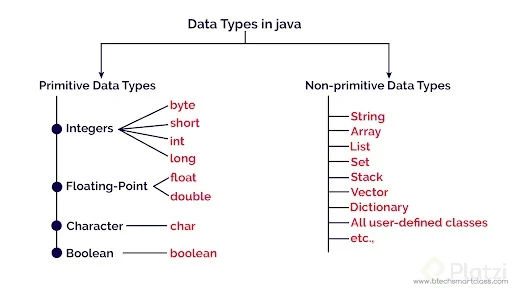
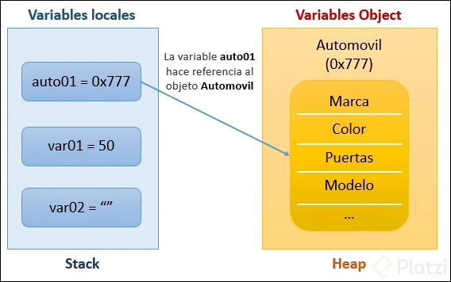

# [Curso de Java](https://platzi.com/cursos/fundamentos-java/)

## ¿Cómo funciona la Java Virtual Machine para lograr la portabilidad?
El secreto de Java está en la **Java Virtual Machine (JVM)**. A diferencia de otros lenguajes, que generan código específico para cada sistema operativo, Java usa la JVM como capa intermedia. Así, el código fuente se compila a un archivo .class en un lenguaje intermedio llamado byte code, que es multiplataforma. Luego, la JVM traduce este byte code en instrucciones específicas para el sistema operativo, ya sea Windows, Mac, Linux o hasta dispositivos embebidos como neveras y tostadoras.

Todo lo que necesitas para ejecutar aplicaciones Java es el **Java Runtime Environment (JRE)**, que incluye la JVM. El **Java Development Kit (JDK)**, por su parte, integra el JRE y además herramientas para escribir, compilar y construir programas.

## ¿Qué es la clase Scanner y para qué sirve en Java?
La clase Scanner es una herramienta que permite leer datos ingresados por el usuario en la consola. Su valor está en la simplicidad para practicar conceptos clave y lograr que cualquier programa Java reciba información de manera amigable.

* Es perfecta para practicar ideas y hacer pruebas rápidas.
* Facilita el aprendizaje, ya que su uso es sencillo e inmediato.
* Resulta funcional para prototipos y ejercicios educativos.

## ¿Cómo se utiliza Scanner para capturar texto y números desde la consola?
Al utilizar Scanner, se sigue un patrón fácil de memorizar:

1. **Declarar el Scanner:** Se crea con `new Scanner(System.in)`. Esto habilita que el programa lea lo que se ingrese por teclado.
2. **Solicitar información al usuario:** Se muestra un mensaje con `System.out.println`. Por ejemplo: ¿Cuál es tu nombre?
3. **Leer una línea de texto:** Usar `scanner.nextLine()` almacena lo que el usuario escribe como una cadena.
4. **Concatenar y mostrar resultados:** Se puede unir texto y variables usando el símbolo +. Por ejemplo: Hola seguido del nombre ingresado.
5. **Capturar números enteros:** Si se necesita almacenar un número, como la edad, basta con usar `scanner.nextInt()`, asignándolo a una variable de tipo entero.

```java
    import java.util.Scanner;

public class Main {
    public static void main(String[] args) {
        Scanner scanner = new Scanner(System.in);
        System.out.println("¿Cuál es tu nombre?");
        String nombre = scanner.nextLine();
        System.out.println("Hola " + nombre + ". Esto es Platzi Play");

        System.out.println(nombre + ", ¿cuántos años tienes?");
        int edad = scanner.nextInt();
        System.out.println(nombre + ", puedes ver contenido más " + edad);
    }
}
```

La programación orientada a objetos es reconocida como un enfoque sólido y flexible para analizar, diseñar y desarrollar software. Se basa en la idea de traducir al código los elementos que nos rodean, considerando cada entidad como un objeto, tanto si es real como abstracta. Esta visión permite construir aplicaciones que simulan la realidad y favorecen una organización clara y ordenada del código.

## ¿Cómo define la programación orientada a objetos a un "objeto"?
Un objeto es cualquier cosa —real o abstracta— que almacena datos y define operaciones para manipular dichos datos. Por ejemplo, en el contexto de un proyecto como Platzi Play, los objetos pueden ser "película", "plataforma", "usuario" o "categoría". Cada uno de ellos guarda datos propios y tiene funciones asociadas para operar sobre esa información.

* Un objeto incluye datos y operaciones relacionadas.
* Los objetos representan entidades del mundo real o conceptos abstractos.
* En cualquier proyecto, los objetos reflejan elementos del contexto específico del software.

## ¿Cuáles son las ventajas principales de usar programación orientada a objetos?
La programación orientada a objetos destaca por varios beneficios directos, entre los cuales resaltan cuatro:

* **Reusabilidad:** Permite reutilizar el mismo código en distintas partes del proyecto o diferentes aplicaciones, facilitando el trabajo y acelerando el desarrollo.
* **Mantenibilidad:** Es más sencillo entender y actualizar el código, ya que se organiza de forma modular y clara.
* **Modificabilidad:** Ofrece la posibilidad de modificar o sumar nuevos componentes sin afectar el funcionamiento del código existente.
* **Fiabilidad:** Facilita el control de errores y la estabilidad general del software, al dividirlo en partes más pequeñas y manejables.

## ¿Cuáles son los pilares fundamentales de la programación orientada a objetos?
Esta metodología se apoya en cuatro pilares fundamentales:

1. **Abstracción.**
2. **Encapsulamiento.**
3. **Herencia.**
4. **Polimorfismo.**

### ¿Qué es la abstracción en programación orientada a objetos?
La abstracción permite identificar y representar de forma precisa las características esenciales y el comportamiento de un objeto. Es decir, se elige lo que es relevante según el contexto del proyecto, dejando de lado lo irrelevante para lograr un sistema más claro y fácil de mantener.

### ¿Cómo diferenciar atributos y métodos en objetos?
* **Atributos:** suelen responder a características o adjetivos del objeto, pueden ser físicos (como duración) o no físicos (como género o popularidad).
* **Métodos:** corresponden a verbos, son acciones que el objeto tiene la capacidad de realizar.

## ¿Cómo se estructuran las clases y paquetes en Java?
En Java, los objetos se crean a partir de **clases**, que son plantillas donde se definen los atributos y comportamientos comunes. Se recomienda agrupar las clases relacionadas en paquetes para mantener el proyecto organizado. Por ejemplo, puedes tener un paquete llamado contenido para clases como Película y otro paquete plataforma para clases como Usuario.

* Consejos clave: - Nombra las clases con mayúscula inicial y en singular. - Evita usar caracteres especiales como "ñ" en nombres de atributos. - Agrupa clases por funcionalidad usando paquetes como contenido o plataforma.

Instancias y clases:

* ***Instancia:*** Una instancia es un objeto que creas a partir de una clase. La clase es como un molde, y la instancia es el producto hecho con ese molde. Ejemplo:
```java
Carro miCarro = new Carro(); // miCarro es una instancia de la clase Carro
```
Los atributos y métodos de instancia viven dentro de cada objeto. Por eso cada objeto puede tener valores diferentes:

```java
Carro carro1 = new Carro(); carro1.color = "Rojo";

Carro carro2 = new Carro(); carro2.color = "Azul";
```
📌 ***Estático (static):*** Algo estático pertenece a la clase, no a un objeto específico. No necesitas crear un objeto para usarlo. Todos los objetos comparten el mismo valor. Ejemplo:
```java
public static int numeroDeRuedas = 4;
```
Se usa así:
```java
Carro.numeroDeRuedas = 4; // sin crear ningún objeto
```

## ¿Qué son los tipos de datos primitivos y los tipos por referencia en Java?
Java organiza sus tipos de datos en dos grandes grupos: primitivos y por referencia (objetos).

* ***Primitivos:*** Son ocho, se usan para valores simples como números, caracteres y booleanos. Todos empiezan con minúscula y son palabras reservadas.
* ***Por referencia u objetos:*** Incluyen clases integradas de Java como String, Date o LocalDate, y cualquier clase que crees, como Película o Usuario.



## ¿Qué es el casting y por qué es importante en Java?
El casting en Java se refiere al proceso de convertir una variable de un tipo de dato a otro. Existen dos modalidades: **el casting implícito**, que realiza Java automáticamente cuando la conversión es segura, y **el casting explícito**, que indica al lenguaje que quieres forzar una conversión incluso si puede implicar pérdida de información.

El casting es fundamental al mezclar tipos de datos diferentes como `int` y `double`.
Es común cuando recibimos datos como texto y necesitamos tratarlos numéricamente.

### ¿Cómo funciona el casting implícito en Java?
El casting implícito ocurre cuando Java puede garantizar que la conversión es segura, como pasar de un tipo de dato pequeño a uno más grande.

Por ejemplo, si tienes una variable de tipo `int` y la asignas a un `long`, Java lo permite sin problemas porque `long` puede almacenar cualquier valor entero.

```java 
int duracion = 120;
long duracionLong = duracion;
System.out.println("Duracion long: " + duracionLong); //Imprime: Duracion long: 120
```

### ¿Cuándo debe usarse el casting explícito y qué riesgos implica?
El casting explícito es necesario cuando convertimos de un tipo más grande o más preciso a uno más pequeño, como de `double` a `int` o de `long` a `int`. Aquí es posible perder información, por lo que Java solicita que el programador especifique la conversión.

```java
double calificacion = 4.7;
int calificacionEntera = (int) calificacion;
System.out.println("Calificacion entera: " + calificacionEntera);
// Imprime: Calificacion entera: 4
```

### ¿Cómo convertir un string a número en Java? ¿Qué método se utiliza?
Una práctica frecuente es transformar datos tipo texto a tipo numérico. Java ofrece métodos en las clases envoltorio para lograr esto.
* Por ejemplo, usando el método `parseLong` de la clase `Long` para convertir un string a long:
```java
String textoNumeroPremios = "25";
long numeroPremios = Long.parseLong(textoNumeroPremios);
System.out.println("Numero de premios: " + numeroPremios);
// Imprime: Numero de premios:  25
```
* Si necesitas ese valor como `int`, puedes hacer un casteo explícito si estás seguro de que el valor está dentro del rango permitido:
```java
int numeroPremiosEntero = (int) numeroPremios;
System.out.println("Numero de premios enteros: " + numeroPremiosEntero);
```

## ¿Qué son los atributos y métodos estáticos en Java?
Un atributo estático pertenece directamente a la clase y no a un objeto individual, por lo que su valor es compartido entre todas las instancias. Lo mismo aplica para los métodos estáticos, los cuales se invocan directamente desde la clase sin crear objetos.

### ¿Cuándo y por qué usar métodos estáticos en clases utilitarias?
* Se usan cuando la funcionalidad no depende del estado de un objeto en particular.
* Ejemplo: métodos para capturar información mediante consola, cálculos matemáticos, o validaciones generales.
* Facilitan evitar la duplicación de código, mejorando la legibilidad y mantenimiento.
* Solo es necesario llamar a la clase y al método estático, sin crear una instancia.
```java
String nombre = ScannerUtils.capturarTexto("Nombre del contenido");
```

### ¿Para qué otras situaciones son útiles los atributos o métodos estáticos?
* Llevar conteos globales de elementos.
* Validar datos.
* Crear clases utilitarias que brindan funciones comunes, no ligadas a una instancia.

## ¿Qué es una constante en Java y por qué usarla?
Una constante es un valor único e inmutable que se asigna una sola vez y no puede modificarse durante la ejecución del programa. Su uso es esencial cuando necesitas asegurar que determinados valores, como configuraciones o límites, permanezcan siempre iguales. Esto ayuda a mantener el código limpio y comprensible.

* Las constantes se definen con las palabras public static final.
* Al ser static, pertenecen a la clase y no a una instancia específica.
* La palabra final indica que el valor no puede cambiar.

### ¿Cómo se declaran constantes en clases Java?
Definir una constante en una clase es una buena práctica, sobre todo para compartir valores comunes en todo el código. Se recomienda nombrarlas en mayúsculas, una convención muy aceptada en Java.

Ejemplo simple para declarar una constante pública de tipo `String`:
```java
public static final VERSION = "1.0.0";
```

## ¿Qué es un constructor en Java y por qué usarlo?
El constructor en Java es un método especial que tiene exactamente el mismo nombre que la clase y no retorna ningún valor. Sirve para inicializar los atributos de los objetos desde el primer momento en que son creados.

Al crear un objeto con `new Película()`, sin parámetros, se utiliza el constructor por defecto.
Si agregas un constructor propio (por ejemplo, que reciba *título, duración y género*), Java ya no brinda uno por defecto.
Personalizar el constructor ayuda a que los objetos tengan la información necesaria desde su origen, como el título, duración y género de una película.

### ¿Cómo definir y utilizar un constructor personalizado?
Definir un constructor personalizado es sencillo y sigue estas pautas:

El constructor se crea después de los atributos y se llama igual que la clase.
Los parámetros que recibes se asignan a los atributos del objeto usando la palabra reservada `this` para distinguirlos.
Puedes asignar valores por defecto a otros campos; por ejemplo, puedes inicializar la fecha de estreno con la fecha actual o marcar el atributo disponible como `true`.

Usar correctamente constructores permite que tu código sea más ordenado, claro y menos propenso a errores, especialmente al manejar múltiples clases y objetos.

## ¿Cómo utiliza Java la memoria stack y heap para almacenar objetos y referencias?
La memoria se divide esencialmente en stack y heap. El *stack* almacena valores de tipos de datos primitivos y referencias a objetos, pero nunca los objetos mismos. Su tamaño es fijo durante la ejecución, y si se sobrepasa, ocurre un ***stack overflow error***.

Por otro lado, el *heap* es donde están los objetos propiamente dichos. Aunque su tamaño inicial se define al arrancar la aplicación, puede cambiar dinámicamente. Si el heap se llena, surge un ***OutOfMemoryError: Java heap space.***

Hay una relación directa entre stack y heap: las referencias viven en el stack y apuntan a los objetos en el heap. 

## ¿Qué diferencia hay entre pasar datos primitivos y objetos en Java?
Al asignar tipos primitivos, se copia el valor real, generando variables independientes. Por ejemplo:

* Si cambias el valor a una variable primitiva copiada, la otra no se afecta.

En cambio, cuando asignas variables de tipo objeto, solo se copia la referencia:

* Varias variables pueden apuntar al mismo objeto en el heap.
* Si modificas el objeto a través de cualquier variable, los demás también reflejan ese cambio.

## ¿Qué sucede cuando un objeto ya no tiene referencias en Java?
Cuando ningún elemento en el *stack* apunta a un objeto en el *heap*, Java lo considera inalcanzable y está listo para ser eliminado. Aquí entra el ***Garbage Collector***:

* Es un proceso automático de Java que elimina objetos no referenciados del heap.
* Se ejecuta en segundo plano y con baja prioridad.
* Java permite invocarlo manualmente, pero se recomienda dejar que la JVM decida cuándo y cómo hacerlo, ya que conoce el mejor momento.

Esta gestión automática evita muchas fugas de memoria y errores por objetos olvidados, facilitando el desarrollo en Java.

### ¿Por qué es importante conocer el ciclo de vida de los objetos en Java?
Saber cómo se manejan las referencias y el ciclo de vida permite programar de forma más segura y eficiente. Comprender conceptos como *stack, heap y garbage collector* ayuda a anticipar problemas como referencias duplicadas, memoria fuera de control o errores de espacio.



## ¿Cómo funciona el encapsulamiento en Java?
El encapsulamiento en Java está directamente relacionado con la visibilidad de los atributos de una clase. Una práctica recomendada es declarar los atributos como privados para impedir el acceso directo desde fuera de la clase. Así, solo se puede interactuar con ellos a través de métodos públicos.

* Los atributos privados no pueden ser modificados ni leídos desde fuera de la clase.
* Los métodos públicos permiten controlar cómo se accede o modifica la información.
* Utilizar modificadores de acceso privados protege los datos sensibles de la clase.

### ¿Para qué sirven los métodos getter y setter en Java?
Cuando se necesita acceder o modificar los valores de los atributos privados, se usan los métodos ***getter y setter***. Los getter permiten obtener información, mientras que los setter se utilizan para establecer valores.

* Un getter devuelve el valor del atributo sin modificarlo. Ejemplo: `getTitulo()` retorna el título de la película.
* Un setter permite cambiar el valor de un atributo si el diseño lo permite. Ejemplo: `setDescripcion()` modifica la descripción de la película.
* Es crucial decidir qué atributos necesitarán setters, especialmente si no conviene que el valor cambie tras la creación del objeto.

### ¿Qué prácticas se recomiendan para escribir clases seguras y robustas?
Seguir estructuras y convenciones claras refuerza la robustez del software y asegura clases seguras:

* Declarar atributos privados por defecto en cada clase.
* Ubicar los métodos getter y setter al final de la clase, luego de atributos, constructores y métodos principales.
* Crear getters solo para los atributos que deban ser consultados desde fuera de la clase.
* Agregar setters únicamente cuando sea indispensable modificar ciertos atributos.
* Analizar si conviene permitir cambios en atributos clave; por ejemplo, el título de una película generalmente no debe modificarse.
* Los métodos públicos son los únicos accesibles externamente, lo cual da mayor control sobre los datos.